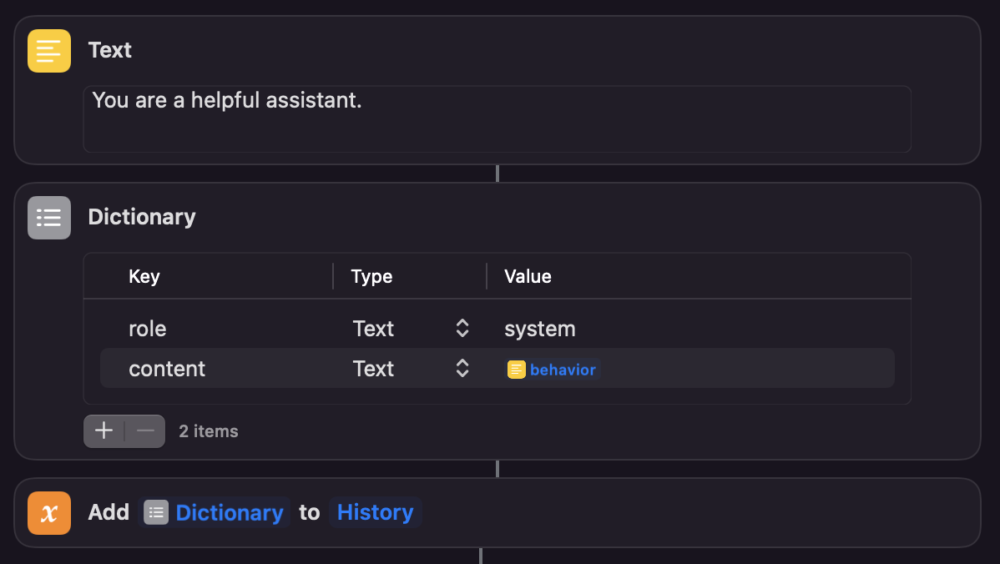

# ChatGPT shortcut on iOS
Access ChatGPT (GPT-3.5-turbo API) with shortcut or Siri voice input on any iOS devices. 
This shortcut will always display the full conversation and save a copy of chat history in local storage (only the latest one).

# iCloud Link to the shortcut
https://www.icloud.com/shortcuts/37b8e21aa4b944ec94a5ec0363e784d5

# Install & Usage
Once you obtain the shortcut from the link, tap on the three-dot icon. If you tap on the name "GPT" at top-center, you can rename it. Siri access would be "Hey Siri, <shortcut_name>", which is "Hey Siri, GPT" by default. Alternatively, you can use the share button at the bottom and add it to home screen. 

⚠️ To use the shortcut, you have to enter your own API key with your account at Openai.

💬 To alter the behavior of the assistant, replace the sentence “You are a helpful assistant” with your own words in the text box above the dictionary section. Please refer to https://github.com/f/awesome-chatgpt-prompts for ideas.

💬 The chat history can be found in `/shortcuts/chatGPT/chatHistory.txt`. Open the files app on iPhone to locate the folder.

# How to obtain the API key
1. Login or register at the OpenAI official site: https://platform.openai.com/
2. Go to `View API Keys` under the account
3. Click on `create a new secret key`
4. Copy the key and paste it into the shortcut

Note that gpt-3.5-turbo is not a free API. It’s priced at $0.002 per 1K tokens. One english word is usually 1-2 tokens.
